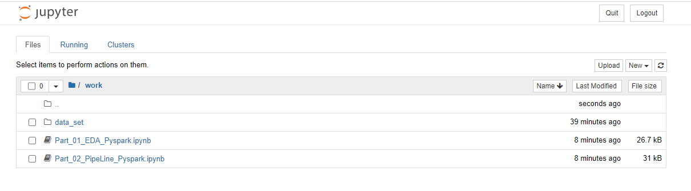

These codes were developed on the Docker image. 
Therefore the user should handle any changes in the address based on the favorite environment.

The docker environment arrangement (used in this case) is seen at the following.

  

